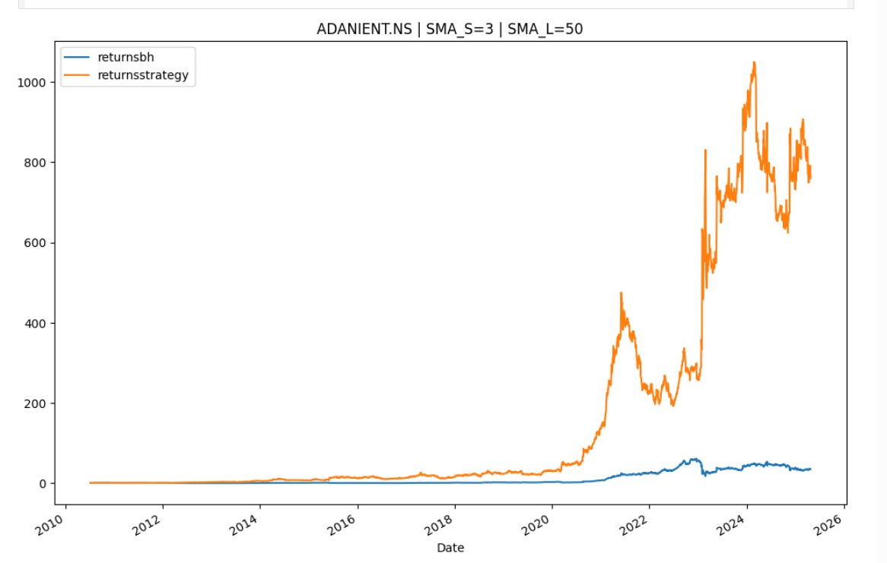
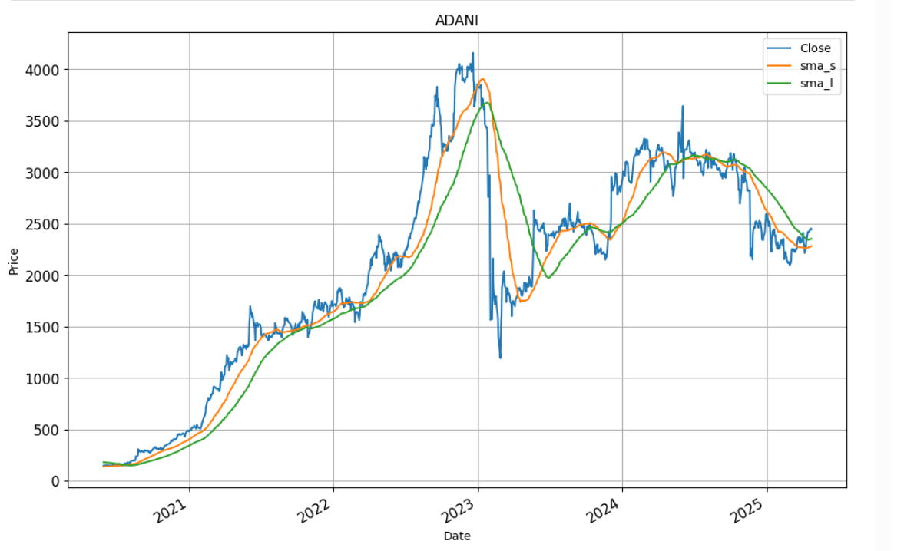
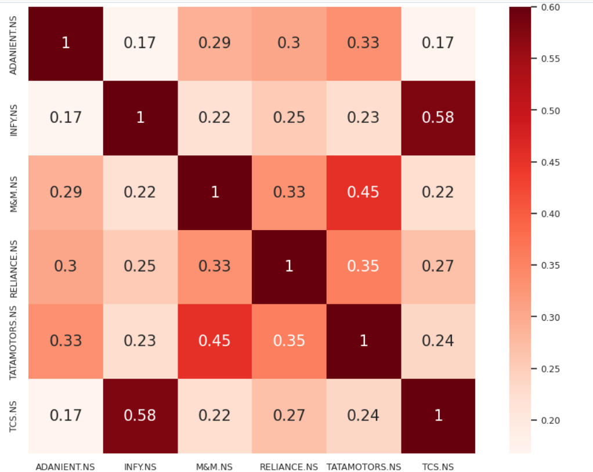
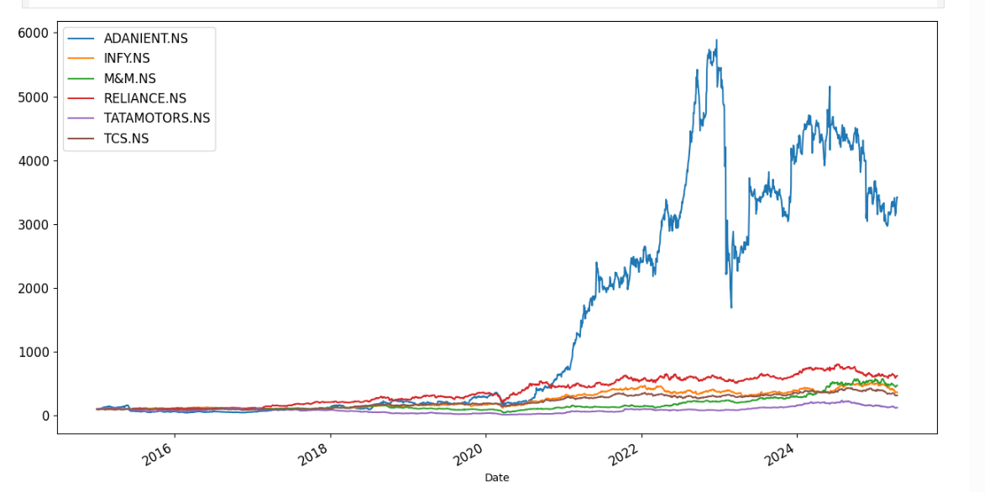

# 📈 Indian Stock Market Analysis & Backtesting Strategies


Welcome to **Indian Stock Market Analysis & Strategy Backtester**, a comprehensive collection of Jupyter notebooks for analyzing and backtesting stock trading strategies on Indian equities using historical data.

---

## 🧠 Features

- ✅ Analyze Indian stock market data from the past 10 years  
- 📊 Implement technical indicators (EMA, SMA, RSI, MACD, etc.)  
- 🔁 Backtest trading strategies using historical price data  
- 🧪 Ready-to-use strategies: EMA crossover, SMA bias, long bias  
- 📈 Visualize signals, trades, and portfolio performance  
- 🗃 Modular notebooks for easy experimentation  

---

## 📂 Repository Structure

```bash
📁 indian_stock_analysis/
│
├── 📘 [ADVANCED]indian_stock_analysis_past10years.ipynb    # Deep analysis of Indian stocks
├── 📘 [BACKTESTER]Financial_Functions.ipynb                # Custom financial & helper functions
├── 📘 Basic_analysis.ipynb                                 # Entry-level analysis on price/returns
├── 📘 emacrossoverstategy.ipynb                            # EMA crossover strategy backtesting
├── 📘 SMA_and_LONGBIAS_Strategy.ipynb                      # SMA-based long-only trading logic
├── 📘 Technical_Indicators.ipynb                           # Technical indicator implementations
```

---

## 📸 Screenshots

### ✅ 1. SMA Crossover Strategy vs Buy & Hold



---

### 📊 2. Price with SMA Short & Long Overlay



---

### 🔥 3. Stock Correlation Heatmap



---

### 📈 4. Return vs Risk Scatter Plot


---

### 📉 5. Normalized Growth of Multiple Stocks


